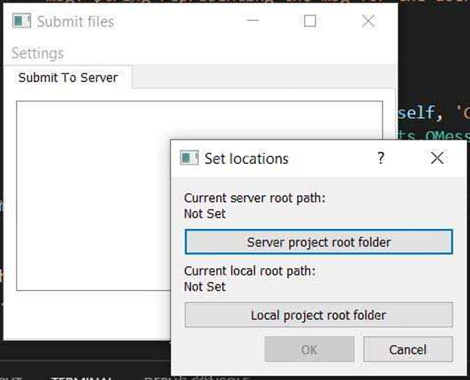

# submit-tool
Tool used to copy files from local host to another host / server within a local network, with same folder structure.

## Set project root folder (Server and Local)
Set the project root folder in the destination side (Server) and the local root folder. This folders should contain the same folder structure to work properly.

This step is only required once the settings are stored under your user folder in your system.
You can always use the Settings menu to reset the root folders.

When you click either "Server project root folder" or "Local project root folder" a browse window is displayed to select your directory.